# Architect Sequential 4 Week Theme

A four-week static frontend project built as a sequential learning theme. Each week keeps the same architectural visual base and adds one new frontend concept step-by-step: semantic HTML, responsive layout, JavaScript interaction, and form validation.

**Live deployment:** https://decodelab.vercel.app/  
**Project type:** Static HTML, CSS, and JavaScript  
**Deployment platform:** Vercel  
**Logo text used:** `POR IMG`  
**Image rule followed:** module images use `object-fit: cover` and include `alt` text.

---

## Preview

### Project Index / Home Page

The root page works as a simple index page. It links to all four weekly folders inside the same Vercel deployment.

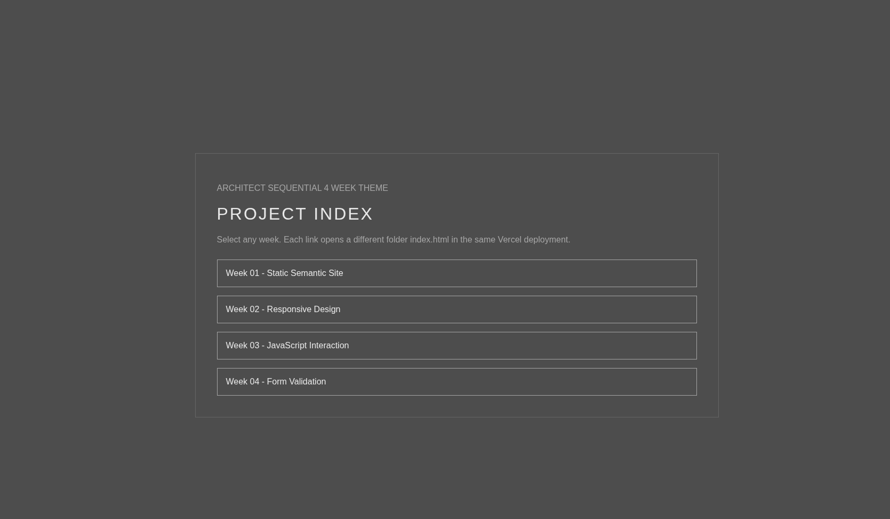

---

## Live Pages

| Week | Focus | Live Path |
|---|---|---|
| Week 01 | Static Semantic Site | `https://decodelab.vercel.app/Task-1-Sagar-Maheshwari/` |
| Week 02 | Responsive Design | `https://decodelab.vercel.app/Task-2_Sagar_Maheshwari/` |
| Week 03 | JavaScript Interaction | `https://decodelab.vercel.app/Task-3-Sagar-Maheshwari/` |
| Week 04 | Form Validation | `https://decodelab.vercel.app/Task-4-Sagar-Maheshwari/` |

The root `index.html` contains four navigation links:

```html
<a href="Task-1-Sagar-Maheshwari/index.html">Week 01 - Static Semantic Site</a>
<a href="Task-2_Sagar_Maheshwari/index.html">Week 02 - Responsive Design</a>
<a href="Task-3-Sagar-Maheshwari/index.html">Week 03 - JavaScript Interaction</a>
<a href="Task-4-Sagar-Maheshwari/index.html">Week 04 - Form Validation</a>
```

---

## Project Goal

The goal of this project is to show frontend growth in a sequential format. Instead of putting every feature into one page immediately, every week adds only the required new concept while preserving the same base architecture, layout direction, typography style, visual identity, and module grid system.

This makes the project easy to review because the progression is clear:

1. Week 01 builds the base static semantic website.
2. Week 02 improves the same website using responsive media queries.
3. Week 03 adds JavaScript-based user interaction.
4. Week 04 adds a validated contact form and completes the final version.

---

## Folder Structure

```text
final/
├── index.html
├── vercel.json
├── README.md
├── Task-1-Sagar-Maheshwari/
│   ├── index.html
│   ├── style.css
│   └── assets/
│       └── background-wave-pattern.webp
├── Task-2_Sagar_Maheshwari/
│   ├── index.html
│   ├── style.css
│   └── assets/
│       └── background-wave-pattern.webp
├── Task-3-Sagar-Maheshwari/
│   ├── index.html
│   ├── style.css
│   ├── script.js
│   └── assets/
│       └── background-wave-pattern.webp
└── Task-4-Sagar-Maheshwari/
    ├── index.html
    ├── style.css
    ├── script.js
    └── assets/
        └── background-wave-pattern.webp
```

---

## Week 01 — Static Semantic Site

**Focus:** HTML and CSS only.

Week 01 creates the base website using clean semantic HTML. The page includes a header, navigation, hero section, reusable project/module cards, and a footer contact block. This version avoids JavaScript and focuses on structure, readability, consistent sections, and accessible image usage.

### Features

- Static website using HTML and CSS.
- Semantic tags such as `header`, `nav`, `main`, `section`, `article`, and `footer`.
- Correct heading order using `h1`, `h2`, and `h3`.
- Six project/module cards.
- Reusable card structure.
- Images with `alt` text.
- Architectural dark grey visual theme.
- Consistent spacing, borders, uppercase headings, and muted typography.

### Screenshot

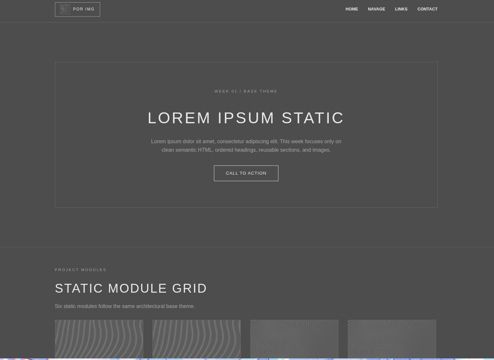

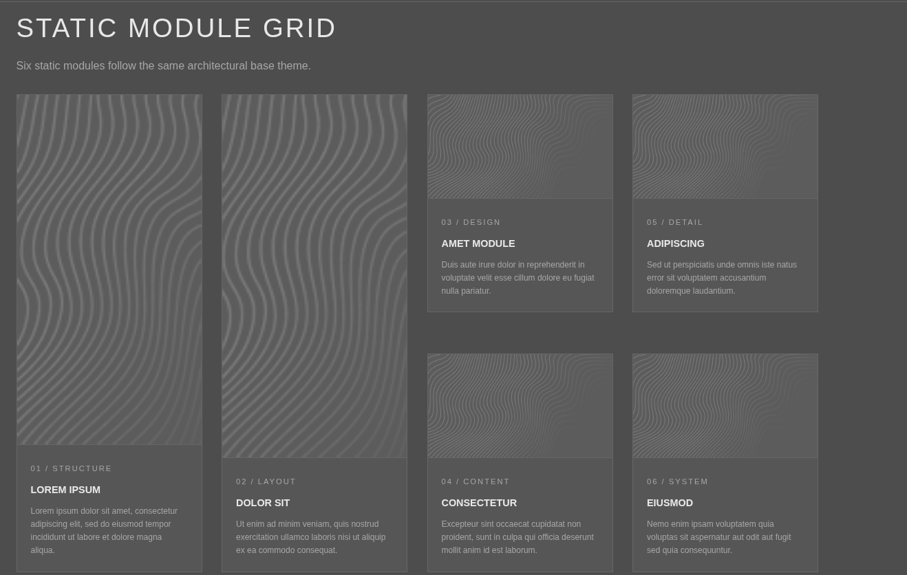

---

## Week 02 — Responsive Design

**Focus:** Media queries and responsive layout.

Week 02 keeps the Week 01 architecture but adds responsive behavior. The layout adapts for larger screens, tablets, and mobile screens while keeping the same theme and same module-card structure.

### Features

- Keeps the base theme from Week 01.
- Adds responsive media queries.
- Module grid adjusts across screen sizes.
- Header and navigation remain consistent.
- Hero spacing and card sizing are improved for smaller devices.
- Footer/contact block remains readable on different screens.

### Screenshot

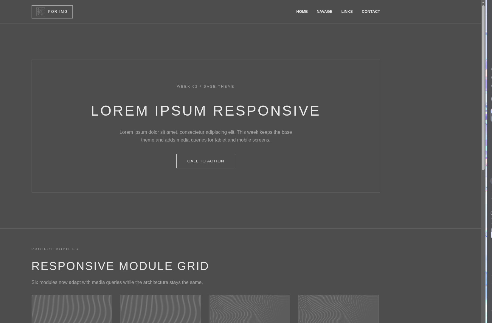

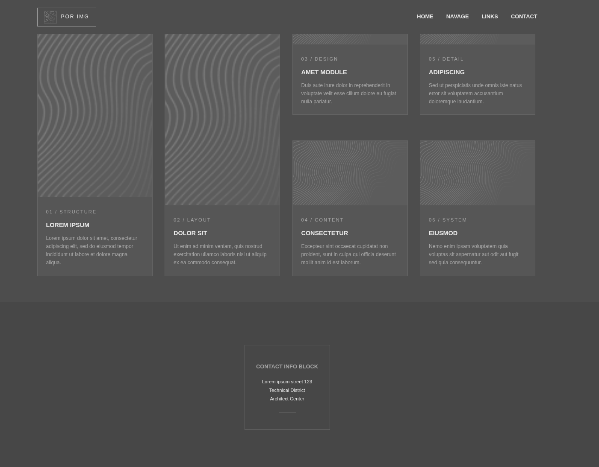

---

## Week 03 — JavaScript Interaction

**Focus:** Buttons, toggles, filters, and dynamic content updates.

Week 03 improves Week 02 by adding JavaScript. The base visual design stays the same, but the page now responds to user actions. This week introduces interaction without changing the overall architecture.

### Features

- Mobile menu button.
- Theme toggle button.
- Filter controls for visible modules.
- Like counter.
- Dynamic text update button.
- Visible project count update.
- JavaScript connected using `script.js`.
- Base layout preserved from previous weeks.

### Interaction Examples

- `LIGHT MODE` button changes theme state.
- `ADD LIKE` increments the like counter.
- Filter buttons show selected categories such as structure, layout, interaction, and form.
- `UPDATE TEXT` changes displayed content dynamically.

### Screenshot

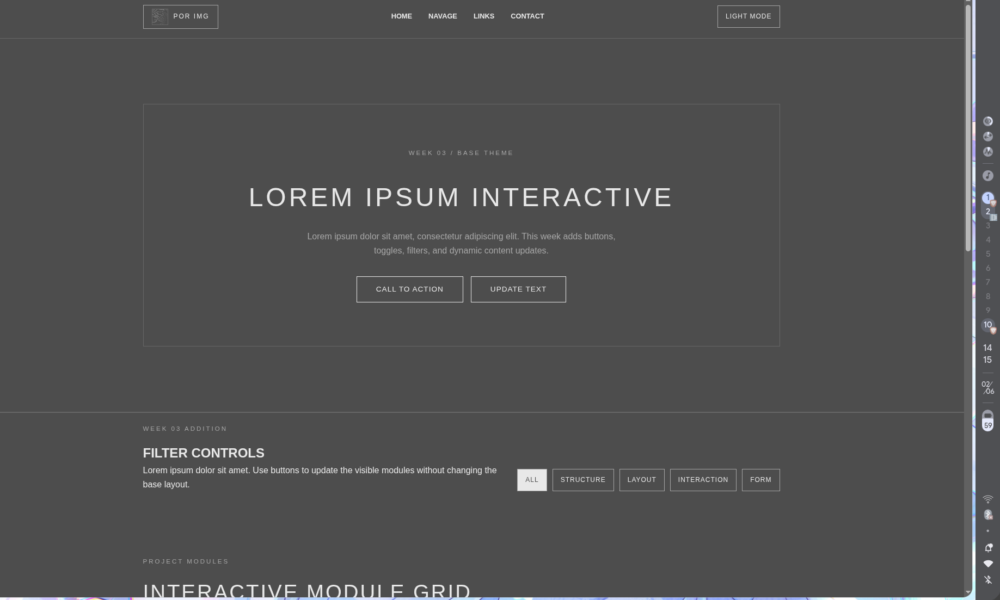

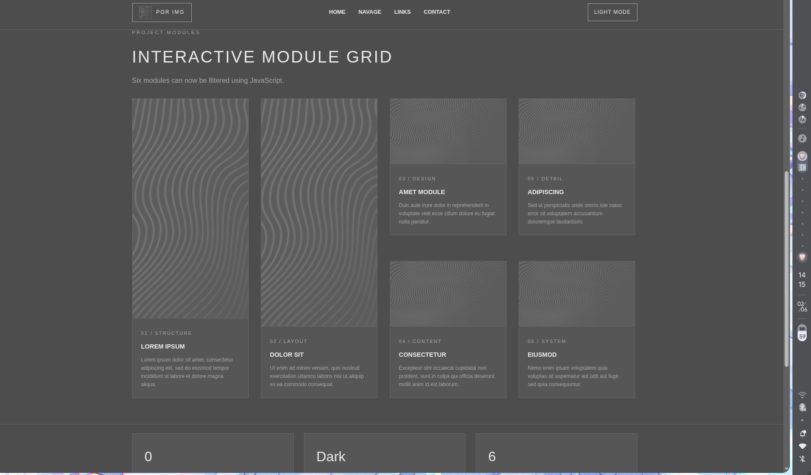

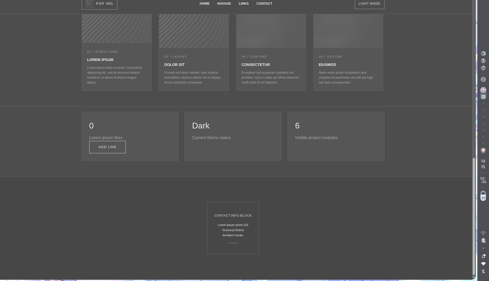

---

## Week 04 — Form Validation

**Focus:** Form validation, error handling, and success feedback.

Week 04 is the final version. It combines the static structure, responsive design, JavaScript interaction, and a validated contact form. The form checks name, email, subject, and message fields before showing success feedback.

### Features

- All Week 03 interactions are retained.
- Adds a contact form section.
- Validates name input.
- Validates email format.
- Validates subject input.
- Validates message input.
- Shows error messages beside invalid fields.
- Shows success message after valid submission.
- Uses `novalidate` so validation is controlled with custom JavaScript.

### Screenshot

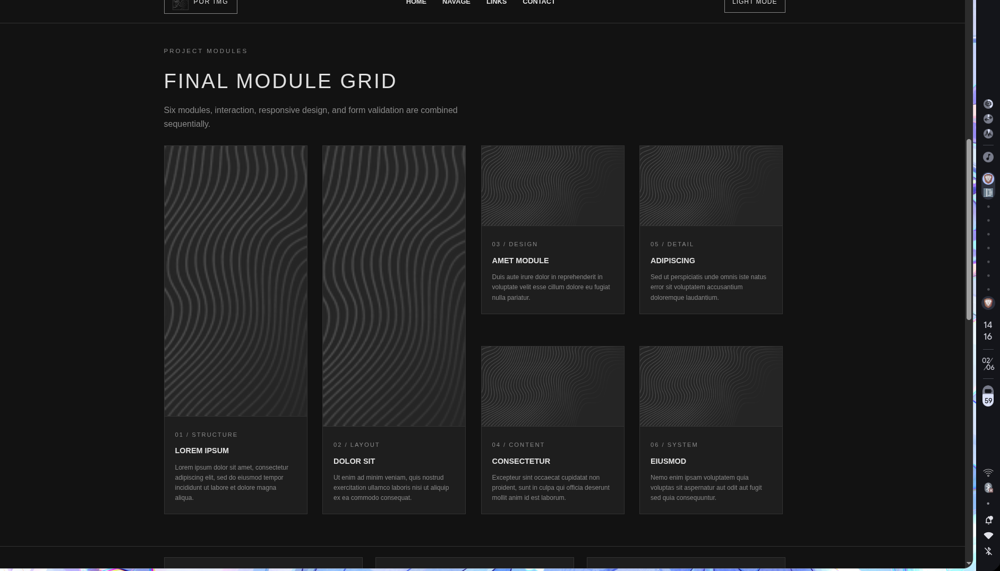

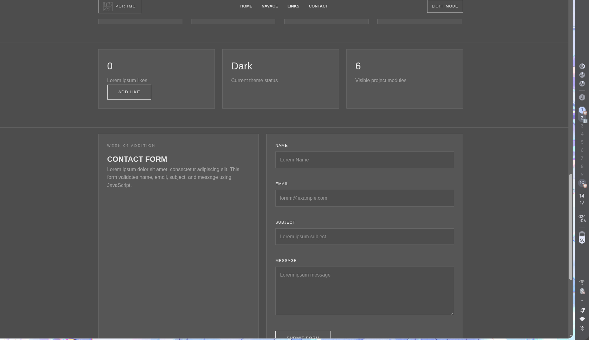

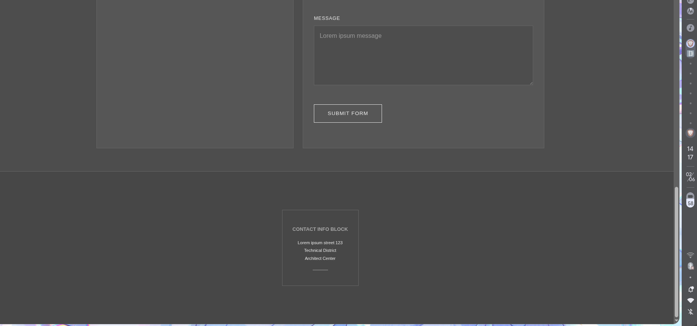

---

## Technologies Used

| Technology | Purpose |
|---|---|
| HTML5 | Page structure and semantic layout |
| CSS3 | Styling, layout, spacing, responsive design |
| JavaScript | User interaction and form validation |
| Vercel | Static deployment |

---

## Design System

The project follows a consistent architectural/minimal visual system:

- Dark grey background.
- Light grey typography.
- Thin border-based UI.
- Wide letter spacing.
- Uppercase section headings.
- Reusable cards.
- Grid-based module layout.
- Abstract architectural wave image pattern.
- Minimal navigation and footer.

---

## How to Run Locally

Clone or download the project, then open the root folder.

```bash
cd final
```

Because this is a static HTML/CSS/JS project, no npm install is required.

You can open `index.html` directly in the browser, or run a simple local server:

```bash
python -m http.server 3000
```

Then open:

```text
http://localhost:3000
```

---

## How to Zip the Project on Garuda Linux

From the parent directory of the `final` folder, run:

```bash
zip -r final.zip final
```

This creates a deployable zip file named `final.zip`.

---

## Vercel Deployment

This project is deployed as a static site on Vercel.

### Deployment Method

1. Push the `final` folder content to a GitHub repository.
2. Import the repository in Vercel.
3. Select the project root that contains `index.html`.
4. Keep build command empty because this is not a React/Vite build.
5. Keep output directory empty or default.
6. Deploy.

### Current `vercel.json`

```json
{
  "cleanUrls": true,
  "trailingSlash": true
}
```

### Why this works

Each week is inside a separate folder with its own `index.html`. The root `index.html` acts as the main project index. Vercel can serve these folders directly as static routes.

Example:

```text
https://decodelab.vercel.app/Task-1-Sagar-Maheshwari/
https://decodelab.vercel.app/Task-2_Sagar_Maheshwari/
https://decodelab.vercel.app/Task-3-Sagar-Maheshwari/
https://decodelab.vercel.app/Task-4-Sagar-Maheshwari/
```

---

## Final Outcome

The final project successfully presents a four-week frontend progression using one consistent theme. It demonstrates semantic HTML, responsive CSS, basic JavaScript interaction, and client-side form validation while preserving the same base architectural design across every week.

